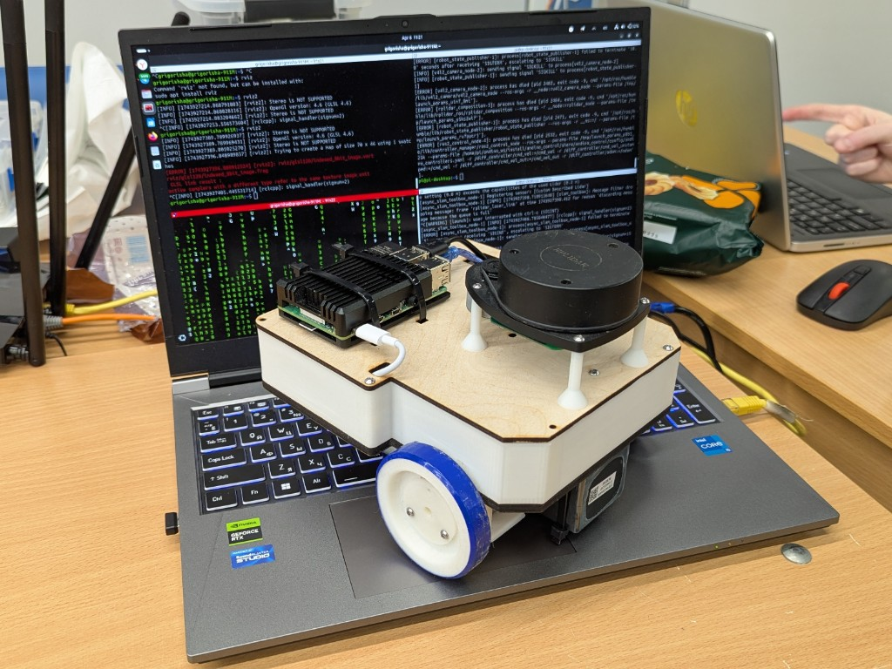
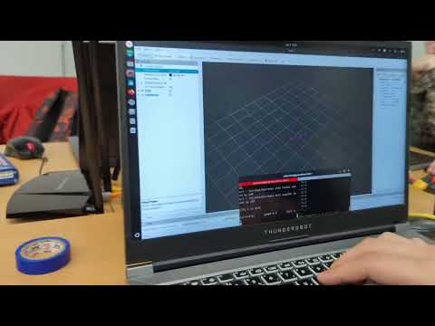
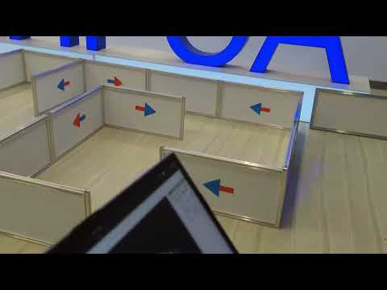
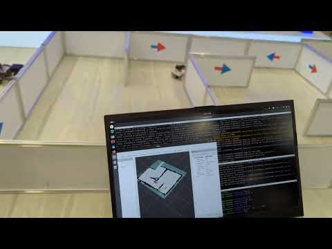

# Ros Slam Robot

Raspberry Pi 4, Arduino UNO ve RPLIDAR A1 kullanan iki tekerlekli bir ROS 2 Humble eğitim robotu. Bu depo; diferansiyel sürüş hesabı, seri motor köprüsü, robot modeli, SLAM ve Nav2 başlatma dosyalarını tek bir özgün ROS 2 paketi içinde sunar.

Ros Slam Robot is a two-wheeled ROS 2 Humble learning robot built around a Raspberry Pi 4, an Arduino UNO and an RPLIDAR A1. This repository provides an original differential-drive controller, serial motor bridge, robot model, SLAM configuration and Nav2 launch setup.

> Kod ve dokümantasyon bu depo için sıfırdan hazırlanmıştır. Donanımı çalıştırmadan önce motor yönlerini, teker ölçülerini ve seri port ayarlarını kendi robotuna göre doğrula.

> The code and documentation were written from scratch for this repository. Verify motor directions, wheel dimensions and serial-port settings on your own hardware before driving the robot.

## Fotoğraflar / Photos

| Robot / Robot | RViz ve lidar / RViz and lidar |
|---|---|
|  |  |

| Haritalama / Mapping | Navigasyon / Navigation |
|---|---|
|  |  |

## Özellikler / Features

- `/cmd_vel` komutlarını sol ve sağ teker hızlarına dönüştürür.
- Converts `/cmd_vel` commands into left and right wheel velocities.
- Arduino ile satır tabanlı, okunabilir bir seri protokol kullanır.
- Uses a simple, readable serial protocol to communicate with the Arduino.
- Teker enkoderlerinden `/odom` ve `odom -> base_link` dönüşümü üretir.
- Publishes `/odom` and the `odom -> base_link` transform from encoder data.
- Xacro tabanlı iki tekerlekli robot modeli içerir.
- Includes a Xacro-based two-wheeled robot model.
- `slam_toolbox`, Nav2 ve RPLIDAR için hazır başlatma dosyaları sağlar.
- Provides launch files for `slam_toolbox`, Nav2 and RPLIDAR.
- Robot ölçüleri, portlar ve hız sınırları YAML üzerinden ayarlanabilir.
- Keeps dimensions, ports and speed limits configurable through YAML files.
- Seri motor köprüsü ve odometri hesabı performans için C++ ile yazılmıştır.
- The serial motor bridge and odometry calculation are implemented in C++ for performance.
- Donanımsız simülasyon ve odometri izleme araçları Python ile yazılmıştır.
- Hardware-free simulation and odometry monitoring tools are implemented in Python.

## Yazılım yapısı / Software architecture

- `src/serial_base.cpp`: Arduino haberleşmesi ve ROS 2 odometrisi.
- `src/serial_base.cpp`: Arduino communication and ROS 2 odometry.
- `src/kinematics.cpp`: Diferansiyel sürüş matematiği.
- `src/kinematics.cpp`: Differential-drive mathematics.
- `scripts/fake_base.py`: Gerçek robot olmadan hareket simülasyonu.
- `scripts/fake_base.py`: Motion simulation without physical hardware.
- `scripts/odom_monitor.py`: Odometri ve lidar sağlık izleyicisi.
- `scripts/odom_monitor.py`: Odometry and lidar health monitor.
- `launch/`: Python tabanlı robot, SLAM ve Nav2 başlatma dosyaları.
- `launch/`: Python launch files for the robot, SLAM and Nav2.

## Gereksinimler / Requirements

- Ubuntu 22.04 ve ROS 2 Humble / Ubuntu 22.04 and ROS 2 Humble
- Raspberry Pi 4 / Raspberry Pi 4
- Arduino UNO uyumlu kart / Arduino UNO-compatible board
- İki DC motor ve enkoder / Two DC motors with encoders
- Motor sürücü / Motor driver
- RPLIDAR A1 / RPLIDAR A1

```bash
sudo apt update
sudo apt install -y \
  ros-humble-desktop \
  ros-humble-navigation2 \
  ros-humble-nav2-bringup \
  ros-humble-slam-toolbox \
  ros-humble-rplidar-ros \
  ros-humble-xacro \
  python3-colcon-common-extensions
```

## Kurulum / Installation

```bash
mkdir -p ~/ros_slam_ws/src
cd ~/ros_slam_ws/src
git clone https://github.com/Furkangnn/Ros_Slam_Robot.git
cd ..
rosdep install --from-paths src --ignore-src -r -y
colcon build --symlink-install
source install/setup.bash
```

Arduino yazılımını `firmware/ros_slam_motor_controller/ros_slam_motor_controller.ino` dosyasından karta yükle. Ardından `udev/99-ros-slam-robot.rules` içindeki kimlikleri cihazlarına göre düzenle.

Upload `firmware/ros_slam_motor_controller/ros_slam_motor_controller.ino` to the Arduino. Then edit the device IDs in `udev/99-ros-slam-robot.rules` to match your hardware.

## Kullanım / Usage

Robot ve lidarı başlat:

Start the robot and lidar:

```bash
ros2 launch ros_slam_robot robot.launch.py
```

Haritalamayı başlat:

Start mapping:

```bash
ros2 launch ros_slam_robot slam.launch.py
ros2 run teleop_twist_keyboard teleop_twist_keyboard
ros2 run nav2_map_server map_saver_cli -f ~/robot_map
```

Kayıtlı harita ile navigasyon:

Navigate using a saved map:

```bash
ros2 launch ros_slam_robot navigation.launch.py map:=$HOME/robot_map.yaml
```

## Seri protokol / Serial protocol

Raspberry Pi, Arduino'ya saniyede 20 kez `V <sol_mps> <sag_mps>` gönderir. Arduino `E <sol_tick> <sag_tick>` yanıtı verir. Bağlantı zaman aşımına uğrarsa iki taraf da motorları durdurur.

The Raspberry Pi sends `V <left_mps> <right_mps>` to the Arduino at 20 Hz. The Arduino replies with `E <left_ticks> <right_ticks>`. Both sides stop the motors if the connection times out.

## Test / Testing

```bash
cd ~/ros_slam_ws
colcon test --packages-select ros_slam_robot
colcon test-result --verbose
```

## Lisans / License

Bu projenin özgün kodu MIT Lisansı ile yayımlanır. ROS 2 paketleri ve donanım sürücüleri kendi lisanslarına tabidir.

The original code in this repository is released under the MIT License. ROS 2 packages and hardware drivers remain subject to their respective licenses.
